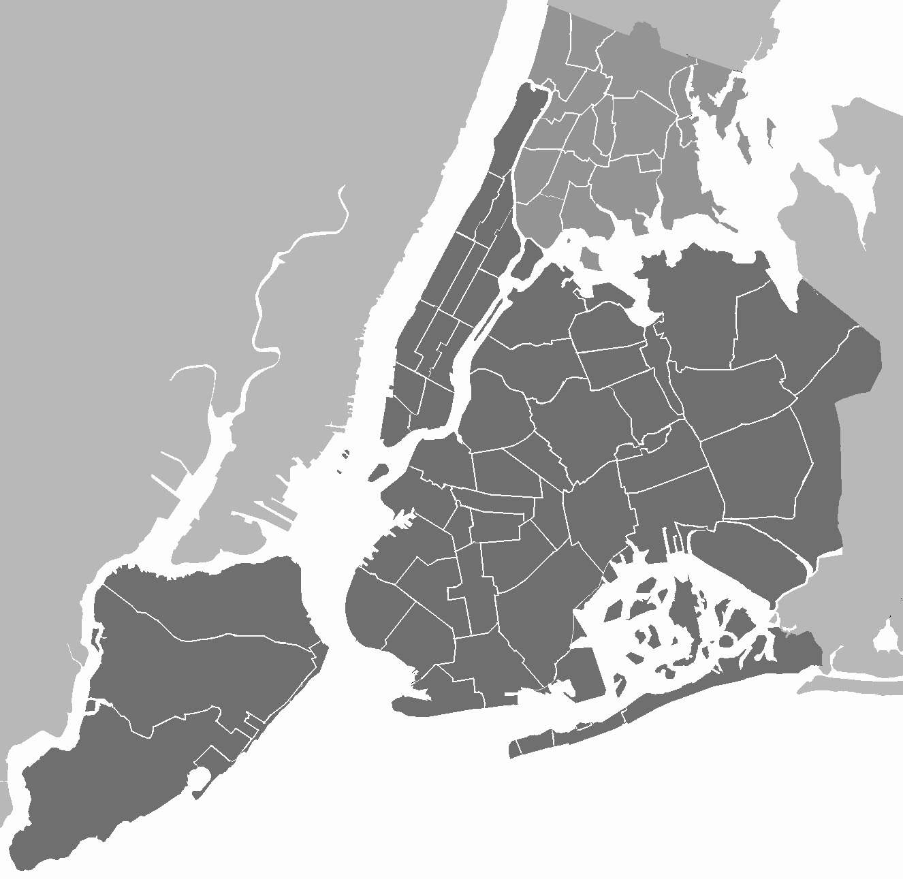

# 🏙️ NYC Airbnb Booking Analysis

Welcome to the **NYC Airbnb Booking Analysis** project! This exploratory data analysis (EDA) dives into Airbnb listings across New York City to uncover trends, patterns, and insights from the dataset provided on Kaggle. The notebook explores various dimensions such as price distribution, neighborhood popularity, availability, and more.
---

## 🎥 Presentation Video

[](https://drive.google.com/file/d/18H-tJHEQQN6E7dcAIt5j-ToC1-4FAYEm/view?usp=share_link)

Click the image above or [click here to watch the video](https://drive.google.com/file/d/18H-tJHEQQN6E7dcAIt5j-ToC1-4FAYEm/view?usp=share_link).

## 📌 Project Overview

This project aims to:

- Perform data cleaning and preprocessing on the Airbnb NYC dataset.
- Explore trends in pricing, availability, and neighborhood popularity.
- Visualize insights using Python libraries like Seaborn, Matplotlib, and Plotly.
- Highlight factors influencing price and booking behavior.

---

## 📂 Repository Structure

```
📁 NYC-Airbnb-EDA/
├── EDA_project_on_NYC_Airbnb_booking_analysis__Project_1_by_Data_Digest.ipynb
├── README.md
└── data/
    └── Airbnb_NYC_2019.csv (to be added by the user)
```

---

## 📊 Technologies & Libraries Used

- **Python 3**
- **Pandas**
- **NumPy**
- **Matplotlib**
- **Seaborn**
- **Plotly**
- **Jupyter Notebook**

---

## 📈 Key Insights

- Manhattan and Brooklyn dominate the Airbnb listings.
- Price variation is highly skewed; most listings fall under $500.
- Certain neighborhoods show higher price tendencies than others.
- Room type plays a major role in price — entire homes/apartments cost significantly more.

*More details are available in the notebook.*

---

## 📁 Dataset

The dataset used in this analysis is available on Kaggle:
[**NYC Airbnb Open Data**](https://www.kaggle.com/dgomonov/new-york-city-airbnb-open-data)

Make sure to download the `AB_NYC_2019.csv` file and place it in a `/data` folder within the project directory.

---

## 🚀 Getting Started

### 1. Clone the repository

```bash
git clone https://github.com/your-username/NYC-Airbnb-EDA.git
cd NYC-Airbnb-EDA
```

### 2. Install dependencies

You can use pip or conda to install the required libraries.

```bash
pip install pandas numpy matplotlib seaborn plotly
```

### 3. Run the notebook

Launch Jupyter and open the notebook:

```bash
jupyter notebook EDA_project_on_NYC_Airbnb_booking_analysis__Project_1_by_Data_Digest.ipynb
```
## 🏅 Certificate & Credentials

This project was completed as part of the **Data Science Program** by [**AlmaBetter Edutech Pvt. Ltd.**](https://www.almabetter.com).

- **Credential Name**: NYC Airbnb Booking Analysis  
- **Issued by**: AlmaBetter Edutech Pvt. Ltd.  
- **Credential Owner**: Vishal Singh  
- **Issue Date**: January 16, 2023  
- **Credential Status**: Verified  
- **Certificate Link**: [🔗 View Credential](https://verified.sertifier.com/en/verify/93136237554026/)  
- **Expiration**: No expiry date

